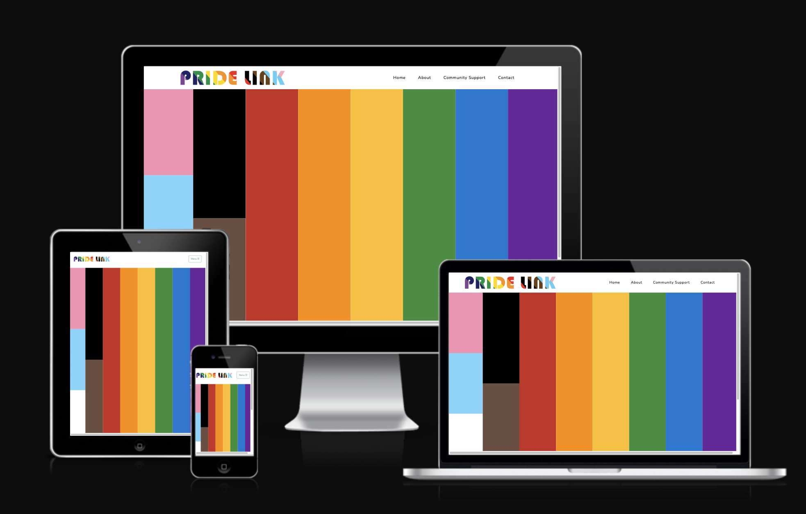
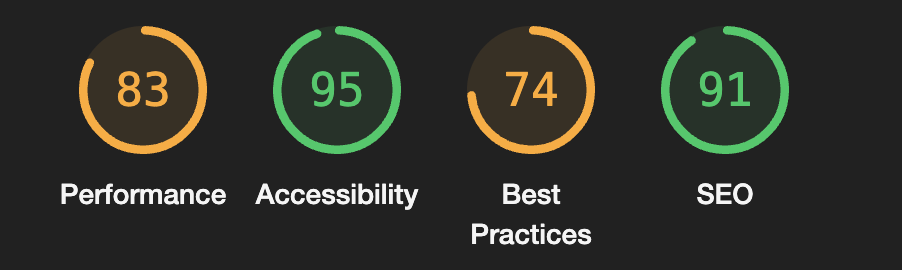
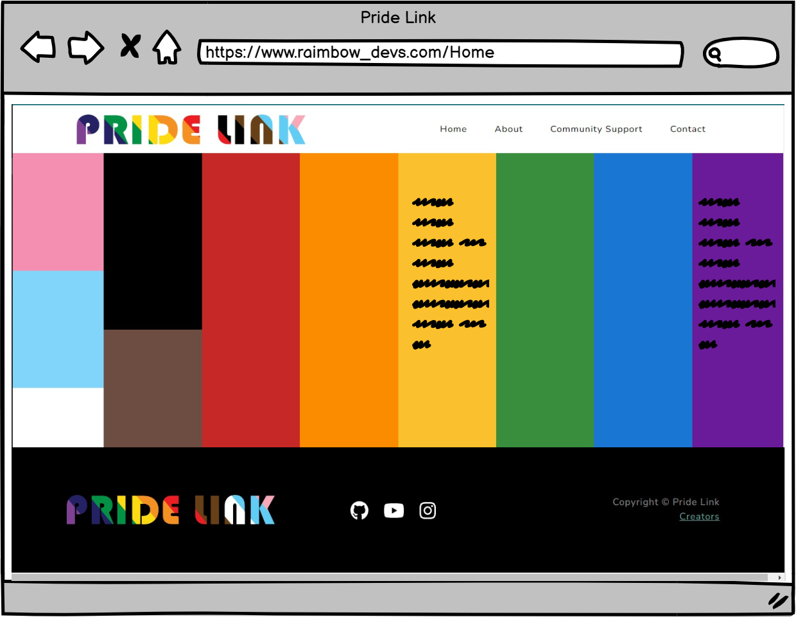
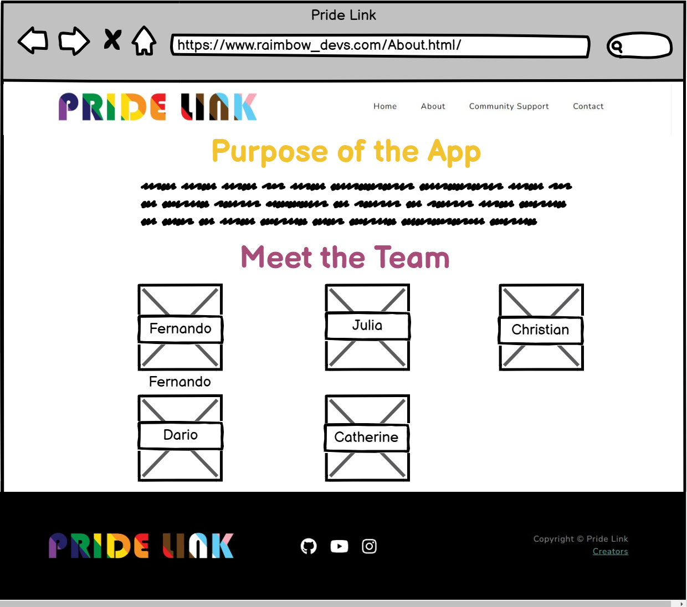
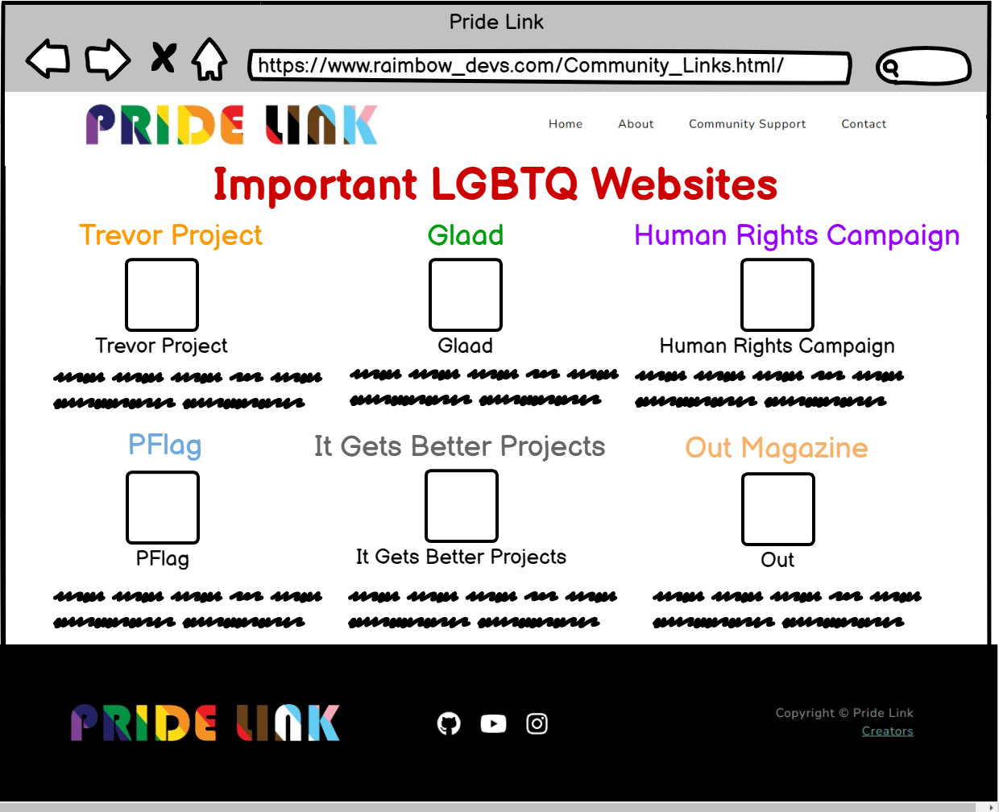
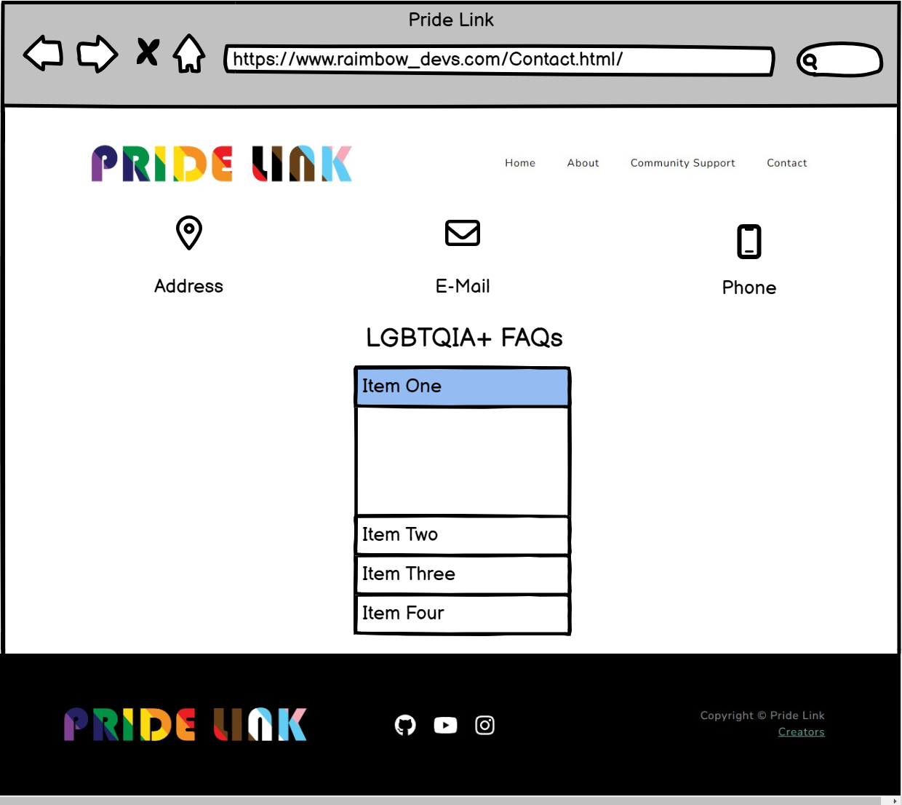

<h1 align="center">🏳️‍🌈 🏳️‍🌈  Pride Link 🏳️‍🌈 🏳️‍🌈 </h1>
<h2 align="center"> BY: Rainbow_DEV </h2>
 
<h1 align="center"><strong>🏳️‍🌈 Proud Coders: July 2024 Hackathon 🏳️‍🌈</strong>

</h1>

# **Intro**

Welcome to "Pride Link"! This app that celebrates diversity and inclusivity in the LGBTQ+ community. The website features a Progress Pride Flag, which is a modified version of the traditional Pride Flag that includes additional colors to represent marginalized groups within the community.
This application aims to create a comprehensive resource hub for the LGBTQIA+ community. Our goal is to offer a centralized platform where members of the LGBTQIA+ community and allies can easily access valuable information about support groups, events, and educational resources. By consolidating these resources, we hope to foster a more connected, informed, and empowered LGBTQIA+ community.

Whether you're seeking support, looking to expand your knowledge, or wanting to engage with the community, this hub is designed to be your go-to source for LGBTQIA+ resources and information.

Live link: [Pride Link](https://goncalves95.github.io/rainbow_Devs/index.html)

# Table Of Content:
- [**Intro**](#intro)
- [Table Of Content:](#table-of-content)
  - [User Experience](#user-experience)
    - [User Stories](#user-stories)
      - [Site-goals](#site-goals)
      - [Agile Methodology](#agile-methodology)
  - [Scope and Plan](#scope-and-plan)
    - [Phase 1: Research and Planning](#phase-1-research-and-planning)
    - [Phase 2: Content Creation](#phase-2-content-creation)
    - [Phase 3: Development and Testing](#phase-3-development-and-testing)
    - [Phase 4: Launch](#phase-4-launch)
  - [SUBMISSION](#submission)
  - [Lighthouse testing](#lighthouse-testing)
- [Deployment](#deployment)
- [Target Audience](#target-audience)
- [Wireframes](#wireframes)
  - [Home](#home)
  - [About](#about)
  - [Community Suport](#community-suport)
  - [Contact](#contact)
    - [Proud Coders Hackathon Kanban](#proud-coders-hackathon-kanban)
- [Technologies used](#technologies-used)
  - [Credits](#credits)

## User Experience

### User Stories

###[#9](https://github.com/Darioc18/rainbow_Devs/issues/9)

###[#7](https://github.com/Darioc18/rainbow_Devs/issues/7)

###[#3](https://github.com/Darioc18/rainbow_Devs/issues/3)

###[more here](https://github.com/users/Darioc18/projects/5/views/1)

#### Site-goals 
1. **Create a comprehensive resource directory**: We aim to compile a thorough list of LGBTQIA+ organizations, support groups, and resources that cater to the diverse needs of the community.
2. **Foster a sense of community**: We hope to create a platform where members of the LGBTQIA+ community can connect, share their experiences, and support one another.
3. **Promote education and awareness**: We strive to provide access to educational resources, workshops, and events that promote understanding, acceptance, and inclusivity of the LGBTQIA+ community.
4. **The objective of** the website is to provide information and useful links for the LGBTQIA+ community.

#### Agile Methodology
The project was developed by using agile methodologies. The development cycle was divided into short sprints, where code was delivered in small chunks for flexibility and good coding practice.
Furthermore, the branch system and forking was used to simulate a real-world developer team environment.

The Kanban board was created to keep track of project progression and issues assessment. Issues were given acceptance criteria and were split into tasks if feasible.

## Scope and Plan

### Phase 1: Research and Planning

* Conduct research on existing LGBTQIA+ resources and organizations
* Identify gaps in current resources and areas for improvement
* Develop a comprehensive plan for the project, including timelines and milestones

### Phase 2: Content Creation

* Create a directory of LGBTQIA+ organizations and resources
* Develop educational content, including articles, videos, and infographics
* Design and develop a community forum for members to connect and share their experiences

### Phase 3: Development and Testing

* Develop the website using HTML, CSS, and JavaScript
* Implement a user-friendly interface and navigation system
* Conduct testing and debugging to ensure the website is functional and user-friendly

### Phase 4: Launch

* Launch the website and make it available to the public

## SUBMISSION

## Lighthouse testing

Lighthouse testing came out to be at least 86 in all areas so is considered to pass.  

# Deployment

1. Log into [GitHub](https://github.com/).
2. Locate the [repository](https://goncalves95.github.io/rainbow_Devs/).
3. Locate the settings option along the options bar at the top of the page.
4. Locate the 'Pages' option on the left side bar and click on it.
5. Under the 'Branch' subheading there should be a drop-down menu - select 'Master' from the branch options.
6. Click the save button.
7. Github pages will build your website with the code supplied and begin hosting it when it is completed - the process usually takes a few minutes.
8. The website URL will now be visible on the green bar under the section header. This will remain there permanently and you can refer back to it at any time.

# Target Audience

Our target audience includes:

* **LGBTQIA+ individuals**: People who identify as lesbian, gay, bisexual, transgender, queer, intersex, asexual, or any other sexual orientation or gender identity.
* **Allies**: Friends, family members, and supporters of the LGBTQIA+ community who want to learn more and show their support.
* **Organizations and businesses**: LGBTQIA+ organizations, non-profits, and businesses that want to reach a wider audience and provide resources to their community.
* **Educators and researchers**: Teachers, professors, and researchers who want to access educational resources and stay up-to-date on the latest research and trends in the LGBTQIA+ community.

# Wireframes

## Home

## About

## Community Suport 

## Contact

### Proud Coders Hackathon Kanban

You can find the Kanban Board [here](https://github.com/users/Darioc18/projects/5/views/1)

# Technologies used

HTML5 as a structure language.  
CSS as a style language.
Javascript as a scripting language.
Bootstrap - Bootstrap@5.1.3 as a CSS framework to keep responsive, mobile first aproach.  
We used the "Creative" template by StartBootstrap (https://startbootstrap.com/theme/grayscale)  
Google fonts as a font resource.  
GitHub as a software hosting platform to keep project in a remote location.  
Git as a version-control system tracking.  
Gitpod as a development hosting platform.
GIMP as an image editor.
## Credits

Rainbow_Dev Team:
* [Fernando Gonçalves](https://www.linkedin.com/in/fernando-goncalves2202/)
* [Dario Covella](https://www.linkedin.com/in/dariocovella/)
* [Julia Volponi](https://www.linkedin.com/in/julia-volponi-9a82752b3/)
* [Christian Cricchi](https://github.com/christiancricchi)
* [Catherine Parrish](https://goncalves95.github.io/rainbow_Devs/about.html)

Inspiration on this WebSite: https://www.verywellmind.com/what-the-colors-of-the-new-pride-flag-mean-5189173
git

Thanks to our Facilitator - Vasilica Pavaloi
